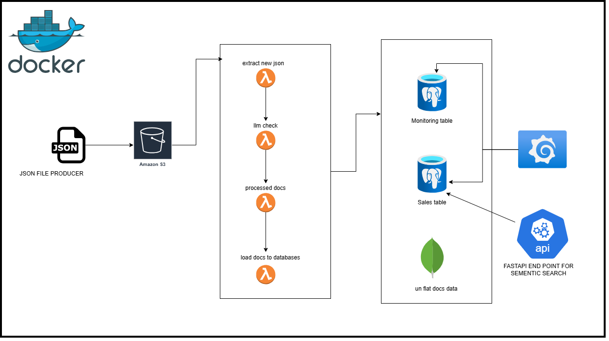
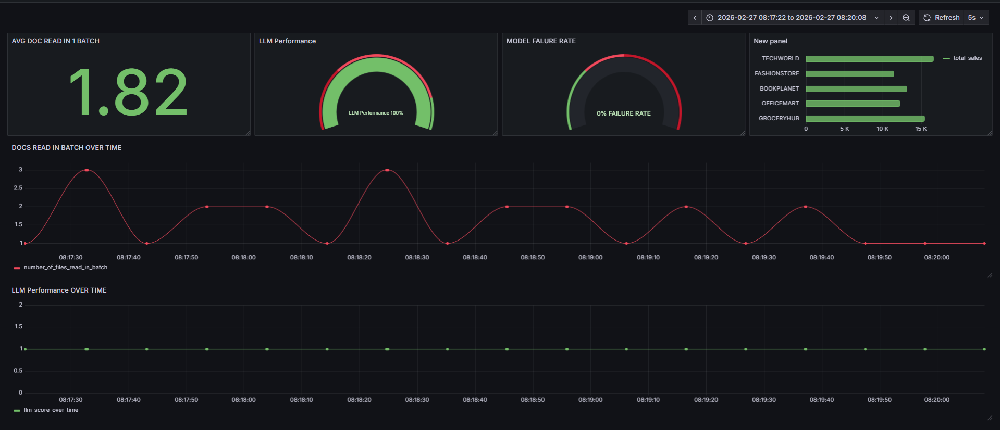

# LLM-Enhanced Text Processing Pipeline

LLM-Enhanced Text Processing Pipeline with
Production Hardening and Monitoring **S3** , **lambda**,**Postgres**, **Mongo** , **FastAPI** and **Grafana**.

## Overview

This project ingests the json docs file from MINIO processed them and did LLM check for some feilds, and writes the results to postgres DB and visualize it in Grafana for monitoring.

**Features:**

- Reads json docs from MINIO bucket: `output-bucket`
- Computes the latest docs in bucket **IN BATCH**
- Processed the docs and do llm check for text matching
- Writes monitoring results to PostgresDB: `monitoring table`
- Writes flatten json results to PostgresDB: `sales table`
- Writes raw docs results to Mongodb : `sales_db`
- Supports unit testing for transformations
- Modular design with separate transformation and sink modules

---

## Architecture

MINIO : For uploading the raw json files works similar to S3

Lambda: Python functions helps to perform extraction, transformation and loading task.

PostgresDB: Database use to store processed and cleaned data for processing and analytics layer.



## Prepare your development environment

- Install Docker in your local machine
- Run docker-compose.yml for up the containers

Go to the current project directory and run the following command in your terminal.

```
docker-compose up --build

```

- Wait for 2-3 minutes until all of the docker containers are running.

## Running Test for datapipeline

- Open a terminal from in code editor
- Change the dir to /src/lambda
- Run this command to unittest data pipeline

```
python -m pytest tests/ -v

```

## Running llm enhanced datapipeline

- Open a terminal
- Make sure you are in this dir /src/lambda
- Run lambda_load.py

## Checking the output

# pgAdmin & PostgreSQL Setup Guide

## Step 1: Log in to pgAdmin

1. Go to the pgAdmin URL:  
   Typically: `http://localhost:5050` (or the port you exposed in your Docker setup).
2. Log in with the pgAdmin Client credentials:
   - **Email Address (ID):** `admin@admin.com`
   - **Password:** `admin`

---

## Step 2: Connect to the PostgreSQL Server

After logging into pgAdmin, register a new server connection to your PostgreSQL database:

1. Right-click on **Servers** → **Create** → **Server...**
2. **General Tab:**
   - Give the server a descriptive name (e.g., `Sensor_Postgres_Server`).
3. **Connection Tab:** Use the following configuration:
   - **Host Name/Address:** `postgres`
     > Note: If you are running pgAdmin on your host machine (not inside Docker), you may need to use `localhost` or your Docker host's IP instead of `postgres`.
   - **Port:** `5432`
   - **Maintenance database:** `Sensor_db`
     > Or `postgres` if `Sensor_db` hasn't been created yet by Spark.
   - **Username:** `admin`
   - **Password:** `admin`
4. Click **Save** to establish the server connection.

---

## Step 3: View the Monitoring Data

1. In the pgAdmin browser tree:
   - Expand the server you just created (e.g., `test`).
   - Expand **Databases → llm_pipeline_db**.
   - Expand **Schemas → public → Tables**.
2. Locate the table named `Monitoring`.
3. Right-click on `Monitoring` and select **View/Edit Data → All Rows**
   - This executes a query to view the monitoring and sales output saved by your llm datapipeline job.

# Grafana Dashboard Access Guide

## Step 1: Open the Dashboard

The Grafana dashboard is already running. Open the following URL in your browser:

```
http://localhost:3000

```

- **Username:** `admin`
- **Password:** `admin` (default, may prompt to reset on first login)

---

## Step 2: Connect Grafana to PostgreSQL

1. In Grafana, go to **Configuration → Data Sources → Add data source → PostgreSQL**.
2. Enter the following connection details:
   - **Host:** `postgres:5432`
     > Use `localhost:5432` if connecting from your host machine.
   - **Database:** `llm_pipeline_db`
   - **User:** `admin`
   - **Password:** `admin`
   - **SSL Mode:** `disable` (for local development)
3. Click **Save & Test** to confirm the connection.

Once connected, the dashboard will show your Monitoring data


